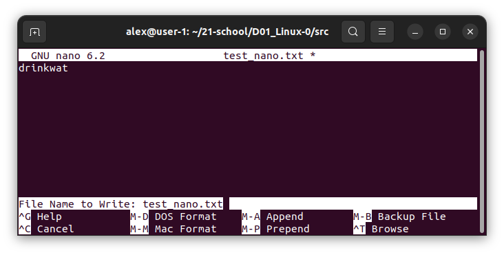
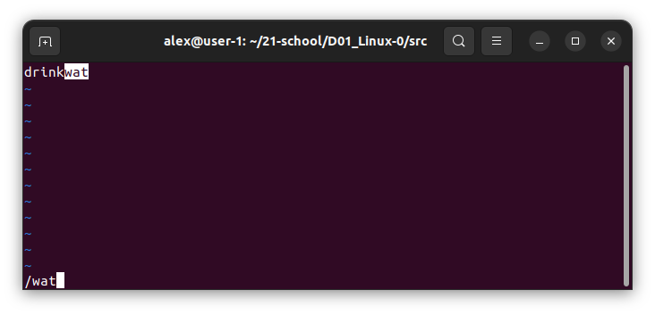
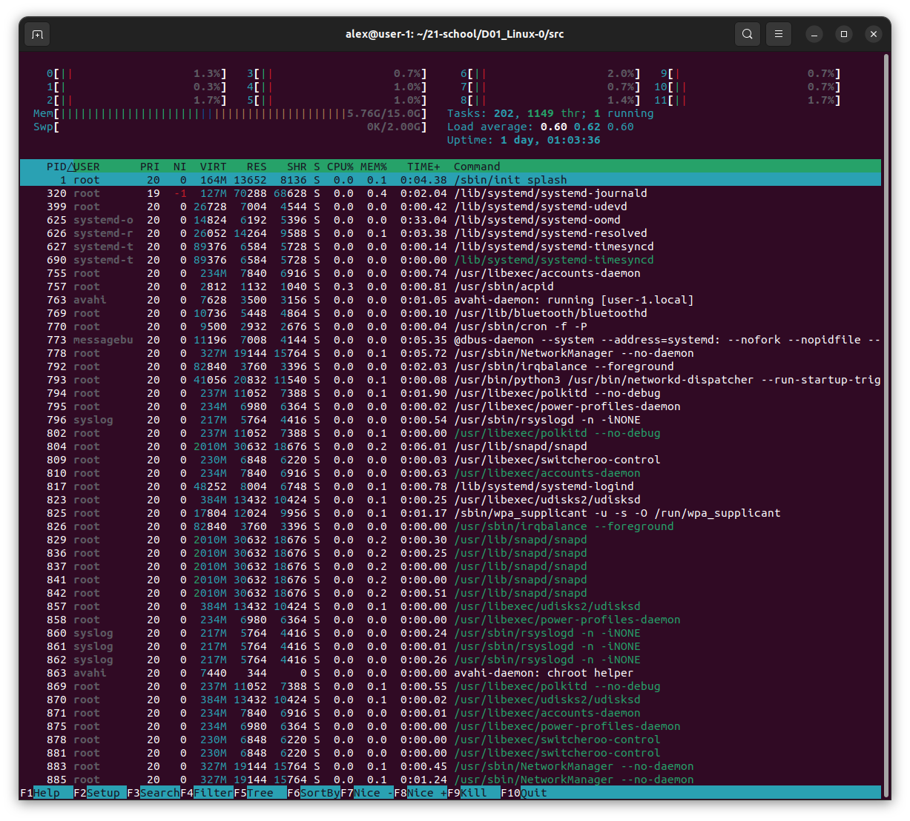
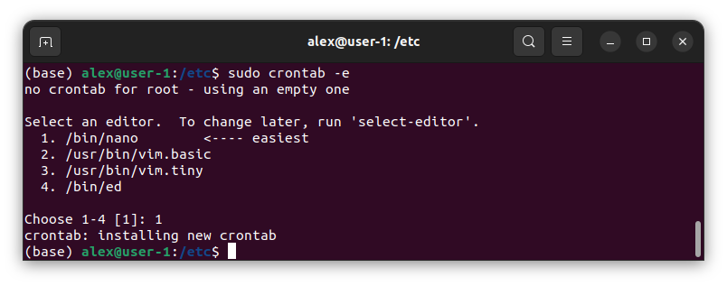

## Part 1. Установка ОС
* Устанавливаем Ubuntu 20.04 Server LTS без графического интерфейса
* Проверяем версию Ubuntu командой `cat /etc/issue` 
 *Версия Ubuntu* 

## Part2. Создание пользователя
* Создаем нового пользователя командой `sudo adduser <имя пользователя>` 
 *Создание нового пользователя* 
* Даем новому пользователю права adm командой `sudo usermod -aG adm <имя пользователя>` 
 *Присвоение прав вдминистратора* 
* Проверяем создание нового пользователя командой `cat /etc/passwd`  
  *Проверка нового пользователя* 

## Part 3.  Настройка сети ОС
* Проверяем текущее название машины командой `hostname` 
  *Проверка названия машины* 
* Изменяем название машины на user-1 использовав команду `sudo hostname <имя хоста>` 
  *Изменяем название машины* 
* Далее меняем название машины в файлах hosts и hostname с помощью редактора nano командами `sudo nano /etc/hosts`    *Редактируем файл hosts* 
и `sudo nano /etc/hostname`    *Редактируем файл hostname* 
* Вызываем перезагрузку системы для сохраниения изменений `sudo reboot` 
  *Перезагружаем систему* 
* Проверяем новое название машины командой `cat /etc/hostname` 
  *Проверяем сохраниение изменений* 
* Вызываем команду `timedatectl` для проверки текущего часового пояса 
  *Проверка текущего часового пояса* 
* Задаем необходимый часовой пояс командой `sudo timedatectl set-timezone Europe/Moscow` 
 *Изменяем часовой пояс* 
* Проверяем изменения командой `timedatectl` 
  *Проверяем изменения* 
* Выводим названия сетевых интерфейсов командой `ip addr`  
  *Названия сетевых интерфейсов* 

* **Loopback** — совокупность методов, нужных для корректной работы маршрутизатора и передачи данных. 
* Сам интерфейс же является отображением логических процессов в маршрутизаторе. Также саму технологию используют и для других целей: 
    1) тестирование передачи данных от обслуживающего центра коммутации; 
    2) проверка сигнала на расстоянии; 
    3) обеспечение работы коммутационных кабелей и их проверка; 
    4) тест обратной петли, когда сигнал посылается и возвращается отправителю по всем коммуникационным каналам. 
* Использовав команду `ip r` узнаем ip-адрес устройства, от DHCP сервера  
  *ip-адрес устройства* 

* **Dynamic Host Configuration Protocol (DHCP)** - это протокол управления сетью, используемый в сетях TCP/IP, в котором DHCP-сервер динамически присваивает каждому устройству IP-адрес и другие параметры сетевой конфигурации, чтобы они могли связываться с другими IP-сетями. 
* Выводим внешний и внутренний ip-адреса шлюза командами `curl 2ip.ru` 
 *Внешний ip-адрес* 
и `ip route | grep default` 
 *Внутренний ip-адрес* 
* Задаем статичные настройки ip, gw, dns командой `sudo nano /etc/resolv.conf` 
 *Редактирование настроек* 
* Перезагружаем виртуальную машину
* Проверяем, что статичные сетевые настройки (ip, gw, dns) соответствуют данным, командой  `ping -c 8 1.1.1.1 && ping -c 8 ya.ru` 
 *Проверяем настройки* 

## Part 4. Обновление ОС
* Командой `sudo apt update` узнаём, сколько есть пакетов обновления 
* Обновляем системные пакеты до последней, на момент выполнения задания, версии командой `sudo apt full-upgrade` 
* После обновления системных пакетов, вводим команду обновления повторно, выводится сообщение, что обновления отсутствуют. 
 *Проверка обновлений* 

## Part 5. Использование команды sudo
* sudo (англ. Substitute User and do, дословно «подменить пользователя и выполнить») — программа для системного администрирования UNIX-систем, позволяющая делегировать те или иные привилегированные ресурсы пользователям с ведением протокола работы. 
Даем пользователю, созданному в Part 2, права на выполнение команды sudo `sudo usermod -a -G sudo <имя пользователя>` 
 *Разрешение sudo* 
* заходим на сервер под другим пользователем `su - <имя пользователя>` 
* Изменяем имя сервера на User-2, командой `sudo hostname User-2`. После ввода пароля проверяем изменения 
 *Изменение имени сервера* 

## Part 6. Установка и настройка службы времени
* Выводим текущее время команой `date` 
 *Текущее время* 
* Активируем NTP командой `sudo timedatectl set-ntp on` 
* Командой `timedatectl show` проверяем подключенную службу синхронизации  
 *NTPSynchronized активна* 

## Part 7. Установка и использование текстовых редакторов
* Устанввливаем тестовый редактор MCEDIT командой `sudo apt install mc` 

**Создаем и редактируем файл с сохранением изменений:** 
**NANO:**
* Создаем файл командой `nano test_nano.txt` и записываем туда свой никнейм 
* Для выхода с сохранением используем команды: `ctrl+x`, `Y`, `Enter` либо `ctrl+o`, `Enter`, `ctrl+x` 
 *NANO новый файл* 

**VIM:**
* Создаем файл командой `vim test_vim.txt` и записываем туда свой никнейм (для прехода в режим вставки нажимаем `i`)  
* Для выхода с сохранением используем команды: `Esc`, `:wq!`, `Enter` 
 *VIM новый файл* 

**MCEDIT:**
* Создаем файл командой `mcedit test_mcedit.txt` и записываем туда свой никнейм 
* Для выхода с сохранением используем команды: `fn+F2`, `Enter`, `fn+F10` 
 *MCEDIT новый файл* 

**Редактируем файл без сохранения зменений:** 
**NANO:**
* Открываем файл командой `nano test_nano.txt` и меняем записаный никнейм на "21 School 21" 
* Для выхода без сохраненя используем команды: `ctrl+x`, `n`, `Enter` 
 *NANO без сохранения* 

**VIM:**
* Открываем файл командой `vim test_vim.txt` и меняем записаный никнейм на "21 School 21" (для прехода в режим вставки нажимаем `i`)  
* Для выхода без сохранения используем команды: `Esc`, `:q!`, `Enter` 
 *VIM без сохранения* 

**MCEDIT:**
* Открываем файл командой `mcedit test_mcedit.txt` и меняем записаный никнейм на "21 School 21" 
* Для выхода без сохранения используем команды: `fn+F10`, `No`, `Enter` 
 *MCEDIT без сохранения* 

**Редактируем файл с поиском и заменой слова:** 
**NANO:**
* Открываем файл командой `nano test_nano.txt` 
* Для поиска в NANO используем комбинацию `ctrl+W` 
 *NANO поиск слова* 
* Для замены слова в NANO вводим `ctrl+\`, пишем слово для поиска, нажимаем `Enter`, пишем слово для замены, нажимаем `Enter`, выбираем `Y` 
 *NANO замена слова* 

**VIM:**
* Открываем файл командой `vim test_vim.txt` 
* Для поиска в VIM пишем команду `/<слово для поиска>` 
 *VIM поиск слова* 
* Для замены слова в VIM вводим используем команду `:%s/<заменяемое слово>/<новое слово>` 
 *VIM замена слова* 

**MCEDIT:**
* Открываем файл командой `mcedit test_mcedit.txt` 
* Для поиска в MCEDIT используем комбинацию `fn+F7` вводим нужное слово или строку и нажимаем   `Enter` 
 *MCEDIT поиск слова* 
* Для замены слова в MCEDIT используем комбинацию `fn+F4` в первом поле пишем заменяемое слово, во втором поле пишем новое слово, нажимаем `Enter` и выбираем `Заменить` 
 *MCEDIT замена слова* 

## Part 8. Установка и базовая настройка сервиса SSHD
* Командой `sudo apt install openssh-server` устанавливаем службу SSHd 
* Подключаем автостарт службы `sudo update-rc.d ssh defaults` 
* Для настройки порта открываем текстовый редактор `sudo nano /etc/ssh/sshd_config` и добавляем строку "Port 2022" 
 *Настройка порта* 
* Перезапускаем сервер SSH для применения изменений `/etc/init.d/ssh restart` 
* Используя команду `ps -axfv | grep sshd` проверяем наличие процесса SSHd 
 *Процессы SSHd* 

* Команда `ps` выводит список текущих процессов на вашем сервере. Используется обычно в сочетании с командой `grep` 
* Флаги: 
  -a: Выбирает все процессы, кроме лидеров сеансов и процессов, не связанных с терминалом. 
  -x: Заставляет `ps` отображать список всех процессов, которыми вы владеете (тот же EUID, что и у `ps`), или перечислять все процессы при использовании вместе с опцией a 
  -f: Выводит полноформатный список 
  -v: Выводит информацию о версии 

* Комндой `sudo apt install net-tools` устанавливаем "net-tools" после чего выполняем команду `netstat -tan` 
 *Команда netstat* 

* Опция **-a** показывает состояние всех сокетов; **-n** показывает ip адрес, а не сетевое имя; **-t** показывает только tcp соединения. 
* Значения столбцов: 
    1) Proto - протокол, используемый сокетом; 
    2) Recv-Q - количество байтов, не скопированных пользовательской программой, подключенной к этому сокету; 
    3) Local Address - локальный адрес (имя локального хоста) и номер порта сокета; 
    4) Foreign Address - удаленный адрес (имя удаленного хоста) и номер порта сокета; 
    5) State - состояние сокета; 
    6) 0.0.0.0 в этом контексте означает "все IP-адреса на локальной машине". 

## Part 9. Установка и использование утилит **top**, **htop**
**top:** 
* Запускаем утилиту `top` одноименной командой и видим необходимую информацию
 *Расшифровка вывода top* 
* Для того, чтобы узнать pid процесса, занимающего больше всего памяти выполним запуск "top" с сортировкой по проценту занятой памяти `top -b -o +%MEM | head -n 22` необходимый процесс будет первым в списке (в данном случае PID процесса - 29018) 
 *pid процесса занимающего больше всего памяти* 
* По аналогии с предыдущим пунктом узнаем pid процесса, занимающего больше всего процессорного времени `top -b -o +TIME | head -n 22` (в данном случае PID - 5386 
 *pid процесса, занимающего больше всего процессорного времени* 

**htop:** 
* Запускаем утилиту командой `htop`, для изменения типа сортировку используем `F6` 
 *PID* 
 *PERCENT_CPU* 
 *PERCENT_MEM* 
 *TIME* 
* Для фильтрации процессов по названию используем комбинацию клавиш `fn+F4` пишем необходимое название в данном случае  "sshd" 
 *SSHd* 
* Для поиска процесса `syslog` используем функцию поиска процессов `fn+F3` 
 *syslog* 

## Part 10. Использование утилиты **fdisk**
* Запускаем утилиту командой `sudo fdisk -l` 
 *Информация о жестком диске* 
    * Название жесткого диска: WDC PC SN730 SDBPNTY-512G-1036 
    * Размер: 476,94 GiB 
    * Количество секторов: 1000215216 
    * Размер swap: 0  

## Part 11. Использование утилиты **df**
* Запускаем команду `df` либо `df /`, для сортировки по корневому разделу 
 *df корневой раздел* 
    * Размер раздела: 490617784 
    * Размер занятого пространства: 71144892 
    * Размер свободного пространства: 394477412 
    * Процент использования: 16% 
    * Единица измерения в выводе: Kb 

* Запускаем команду `df -Th` либо `df -Th /`, для сортировки по корневому разделу 
 *df -Th корневой раздел* 
    * Размер раздела: 468G 
    * Размер занятого пространства: 68G 
    * Размер свободного пространства: 377G 
    * Процент использования: 16% 
    * Тип файловой системы для раздела: ext4 

## Part 12. Использование утилиты **du**
* Запускаем команду `du`  
 *Вывод команды du* 
* Выводим размер папок в байтах `/home`, `/var`, `/var/log` с помощью команды `sudo du -s -h -b /home && sudo du -s -h -b /var && sudo du -s -h -b /var/log` 
 *Размер папок в байтах* 
* Выводим размер всего содержимого в `/var/log` с помощью команды `sudo du -a -h /var/log` 
 *Размер всего содержимого в /var/log* 

## Part 13. Установка и использование утилиты **ncdu**
* Устанавливаем утилиту **ncdu** командой `sudo apt install ncdu` 
* Выводим размер необходимых папок используя команду `ncdu`: 
 *ncdu /home* 
 *ncdu /var* 
 *ncdu /var/log* 

## Part 14. Работа с системными журналами
* Открываем для просмотра системные журналы:
 */var/log/dmesg* 
 */var/log/syslog* 
 */var/log/auth.log* 
* Для того чтобы узнать время последней успешной авторизации используем команду `last` 
 *Время последней успешной авторизации* 
* перезапускаем службу SSHd и проверяем и ищем в логах сообщение о рестарте службы командами `sudo systemctl restart ssh` и `cat /var/log/syslog` 
 *Перезапуск SSHd в логах* 

## Part 15. Использование планировщика заданий **CRON**
* Настраиваем cron для работы в фоновом режиме `sudo systemctl enable cron` 
* Для того, чтобы запланировать задачу используем команду `crontab -e`, затем выбираем один из предложенных текстовых редакторов 
* В открывшемся файле дописываем необходимую задачу (в нашем случае `"*/2 * * * * uptime"`), сохрняем и закрываем редактор, в терминале отобразится соощение об успешном добавлении задачи 
 *Задача добавлена* 
* Проверяем список текущих задач командой `crontab -l` 
 *Список текущих задач* 
* Проверяем выполение задач в логах командой `grep CRON /var/log/syslog` 
 *Задача uptime в логах* 
* Для удаления всех задач из планировщика используем команду `crontab -r` 
* Снова проверяем список текущих задач командой `crontab -l` 
 *Задачи отсутсвуют* 

