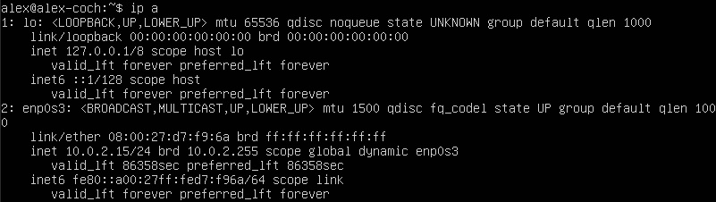
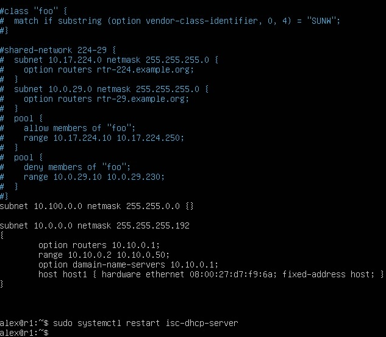
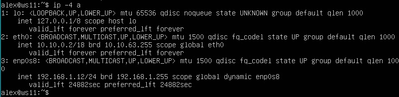

## Отчет по проекту Linux Network
- Установлена VM Ubuntu 20.04 Server LTS 
  

## Part 1. ipcalc tool
### 1.1. Сети и маски
- Сетевой адрес 192.167.38.54/13 
  
- Перевести маску 255.255.255.0 в префиксную и двоичную 
 
- Перевести маску /15 в обычную и двоичную 
 
- Перевести маску 11111111.11111111.11111111.11110000 в обычную и префиксную 
 
 	-Минимальный и максимальный хост в сети 12.167.38.4/8 
 
- 11111111.11111111.00000000.00000000 
 
- 255.255.254.0 
 
- /4 
 

### 1.2. localhost	
- Определить доступность по ip-адресам
- 194.34.23.100 
  
- 127.0.0.2 
 
- 127.1.0.1 
 
- 128.0.0.1 
 

### 1.3. Сетевые дипазоны и сегменты
IP-addresses:
- 10.0.0.45 
  частный
- 134.43.0.2 
  публичный 
- 92.168.4.2 
  публичный
- 172.20.250.4 
  частный
- 172.0.2.1 
  публичный
- 192.172.0.1 
  публичный
- 172.68.0.2 
  публичный
- 172.16.255.255 
  частный
- 10.10.10.10 
  частный
- 192.169.168.1 
  публичный

Gateways:
- Для сети 
  
 возможные gateways:
- 10.0.0.1 x
- 10.10.0.2 v 
- 10.10.10.10 v 
- 10.10.100.1 x 
- 10.10.1.255 v

## Part 2. Static routing between two machines
ip a:
- ws1 
 
- ws2 
 

etc/netplan/00-installer-config.yaml:
- ws1 
 
- ws2 
 

sudo netplan apply:
- ws1 
 
- ws2 
 

### 2.1 Добавление статического маршрута вручную
- ws1 
 
- ws2 
 

Ping:
- ws1 
 
- ws2 
 

## Part 3. iperf3
### 3.1 Скорость соединения
- 8 Mbps = 1 MB/s 
- 100 MB/s = 100000 Kbps 
- 1 GB/S = 1000 Mbps

### 3.2 iperf3
- ws1 
 
- ws2 
 

## Part 4. Firewall
### iptables
- ws1 etc/firewall.sh 
 
- ws2 etc/firewall.sh 
 
- 1я стратегия на ws1 разрешает ping, 2я на ws2 - запрещает

### nmap
- ws2 nmap 
 

## Part 5. Static network routing
### 5.1. Конфигурация
- ws11 
 
- ws21 
 
- ws22 
 
- r1 
 
- r2 
 
- ping ws22 from ws21 
 
- ping r1 from ws11 
 

### Part 5.2. IP forwarding
- sysctl -w net.ipv4.ip_forward=1 on r1 
 
- sysctl -w net.ipv4.ip_forward=1 on r2 
 
- /etc/sysctl.conf on r1 
 
- /etc/sysctl.conf on r2 
 

### 5.3. Default route configuration
- ws11 
 
- ws21 
 
- ws22 
 
- Ping r2 router from ws11 
 
- tcpdump -tn -i eth1 
 

### 5.4. Adding static routes
- r1 
 
- r2 
 
ip r:
- r1 
 
- r2 
 
- ip r list 10.10.0.0/[netmask] and ip r list 0.0.0.0/0 commands on ws11 
 
 Для адреса 10.10.0.0/18 был выбран маршрут, отличный от 0.0.0.0/0, потому что маска /18 описывает маршрут к сети точнее, в отличие от маски /0

### 5.5. Making a router list
- ws1 traceroute 
 
- r1 tcpdump 
 
- Путь строится от узла к узлу до того момента, пока не будет достигнута конечная точка. Каждый пакет проходит на своем пути определенное количество узлов, пока не достигнет своей цели. На каждом узле добавляется счетчик, который отслеживает количество пройденых узлов.
- ws1 ping 
 
- r1 tcpdump 
 

## Part 6. Dynamic IP configuration using DHCP
- r2 /etc/dhcp/dhcpd.conf 
 
- resolv.conf 
 
- systemctl restart isc-dhcp-server 
 
- ws21 ip a 
 
- ping ws22 from ws21 
 
- ws11 
 
- r1 
 
- ip a ws11 
 
- ip a ws12 before 
 
- ip a ws11 after 
 
- В данном пункте используем опции: 'dhclient -r', 'dhclient -v'

## Part 7. NAT
- r1 /etc/apache2/ports.conf & service apache2 start 
 
- ws22 /etc/apache2/ports.conf & service apache2 start 
 
- r2 
 
- ping 
 
- Allow routing of all ICMP protocol packets 
 
- ping 
 
- SNAT, DNAT 
 
- from ws22 
 
- from r1 
 

## Part 8. SSH
- ws22 
 
- ws21 
 
- ws11 
 
- ws22 
 
- ws21  
