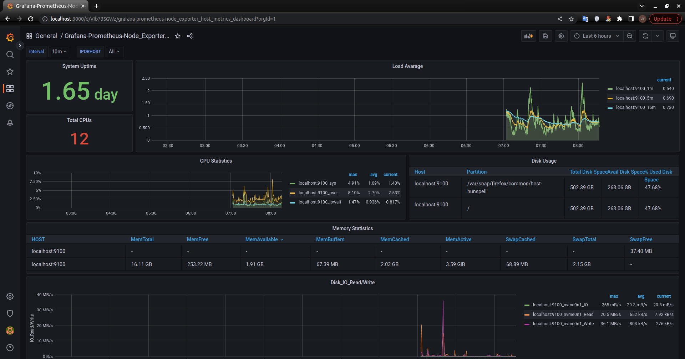
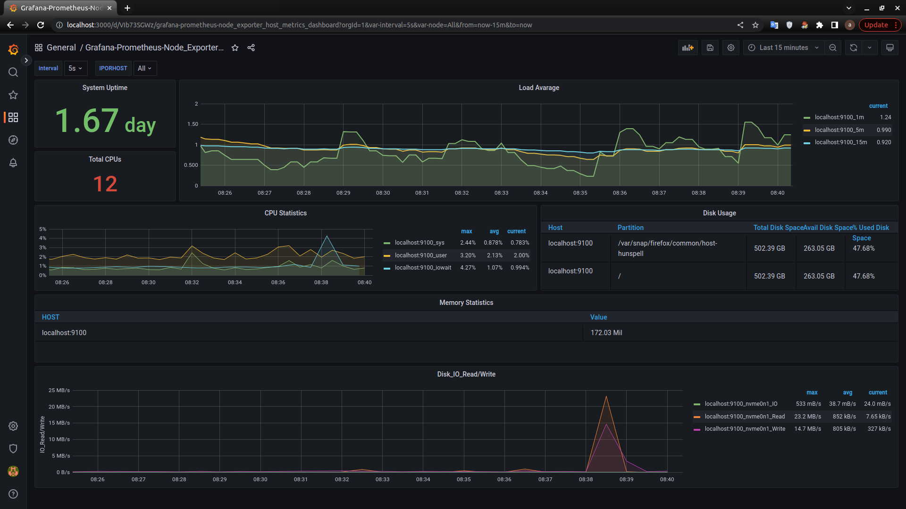
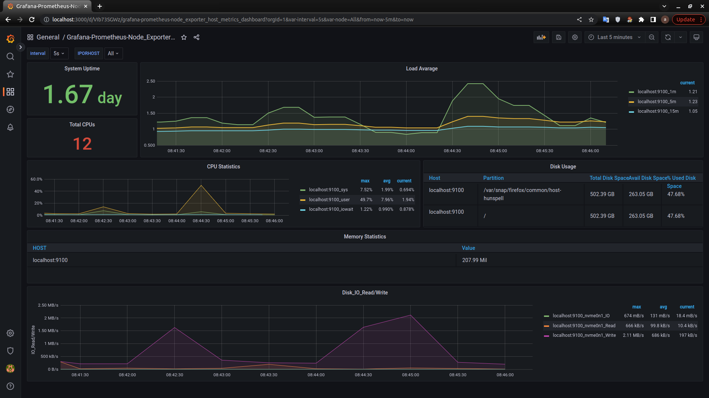

## Part 7. **Prometheus** и **Grafana**

##### Получить доступ к веб интерфейсам **Prometheus** и **Grafana** с локальной машины

##### Добавить на дашборд **Grafana** отображение ЦПУ, доступной оперативной памяти, свободное место и кол-во операций ввода/вывода на жестком диске

##### Запустить ваш bash-скрипт из Части 2
##### Посмотреть на нагрузку жесткого диска (место на диске и операции чтения/записи)

##### Установить утилиту **stress** и запустить команду `stress -c 2 -i 1 -m 1 --vm-bytes 32M -t 10s`
##### Посмотреть на нагрузку жесткого диска, оперативной памяти и ЦПУ

