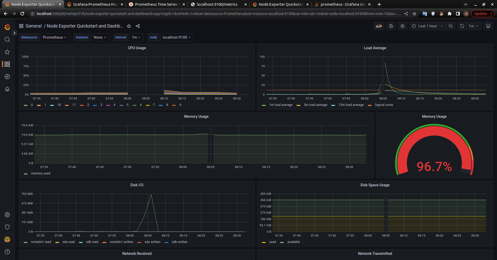
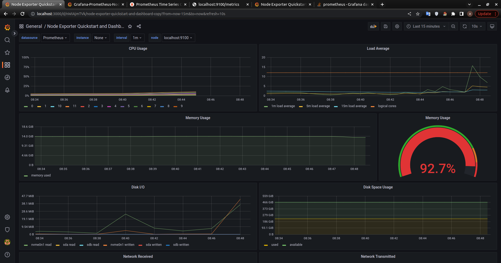

## Part 8. Готовый дашборд

##### Установить готовый дашборд *Node Exporter Quickstart and Dashboard* с официального сайта **Grafana Labs**
# 

##### Запустить bash-скрипт из Части 2. Посмотреть на нагрузку жесткого диска (место на диске и операции чтения/записи)
# 

##### Установить утилиту **stress** и запустить команду `stress -c 2 -i 1 -m 1 --vm-bytes 32M -t 10s`
##### Посмотреть на нагрузку жесткого диска, оперативной памяти и ЦПУ
# 

##### Запустить ещё одну виртуальную машину, находящуюся в одной сети с текущей
##### Запустить тест нагрузки сети с помощью утилиты **iperf3**
##### Посмотреть на нагрузку сетевого интерфейса
# 
